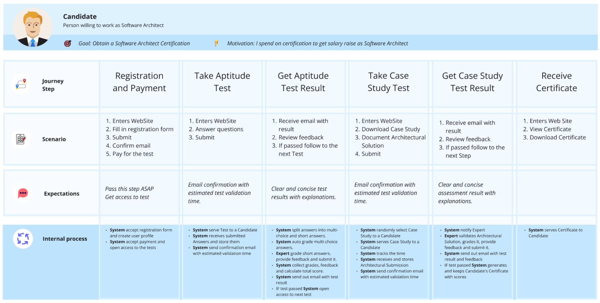
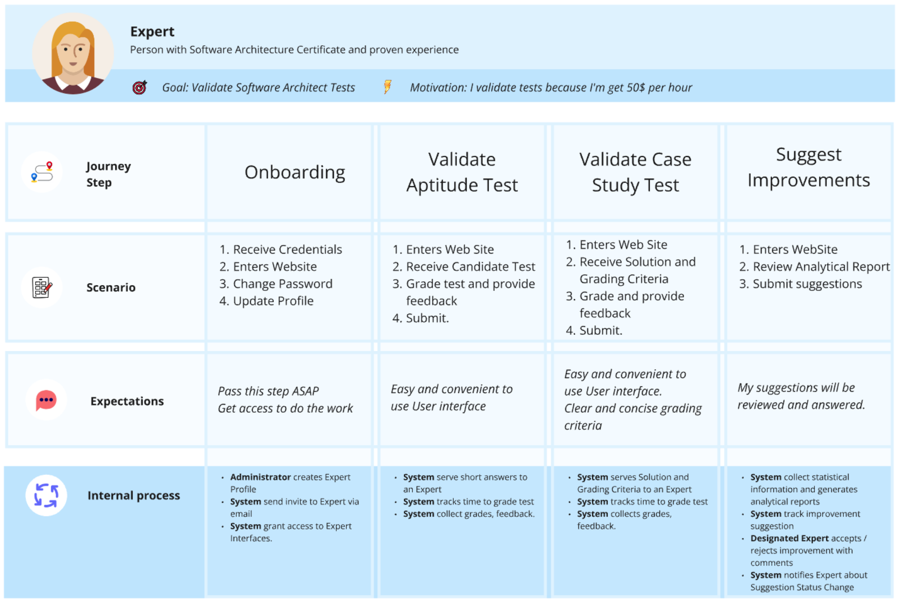
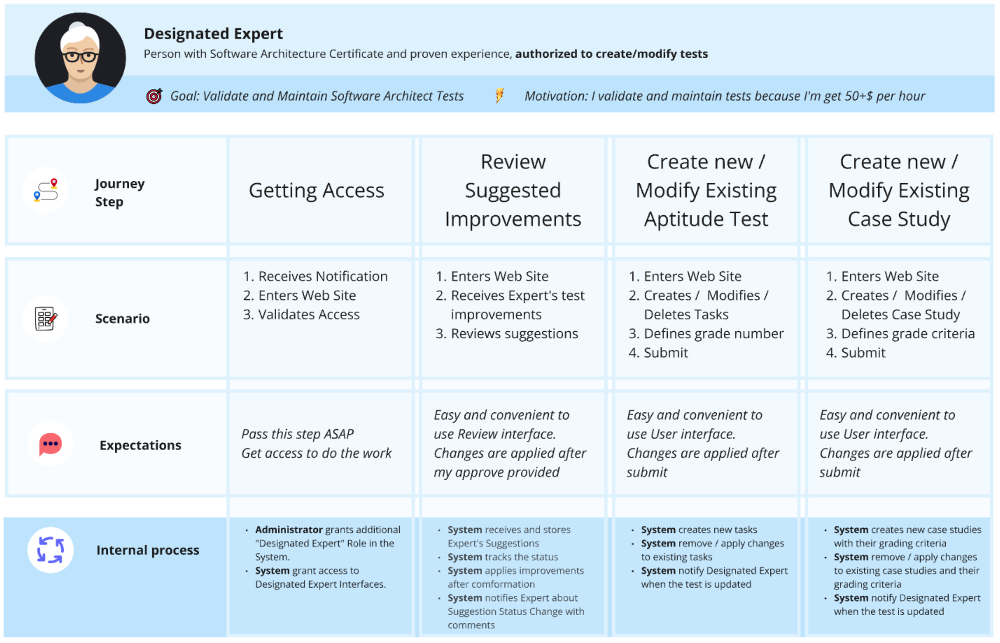
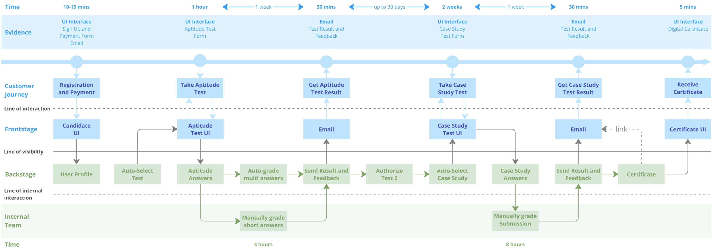
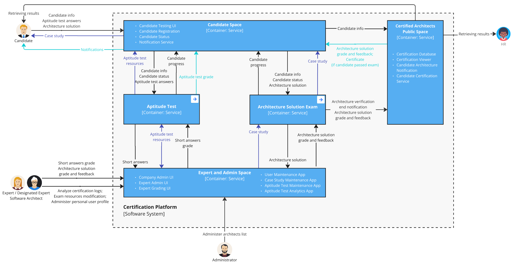
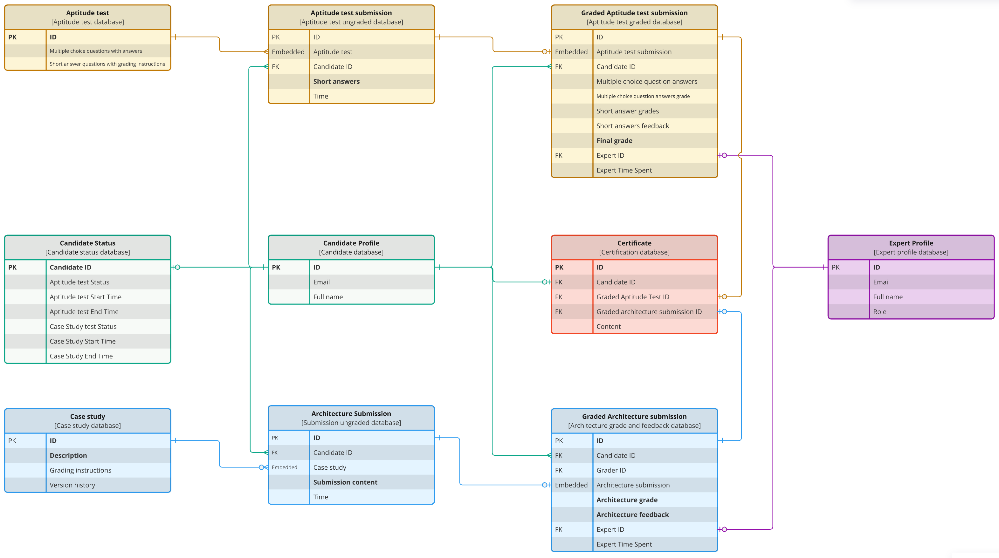
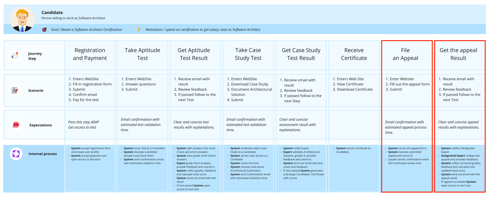
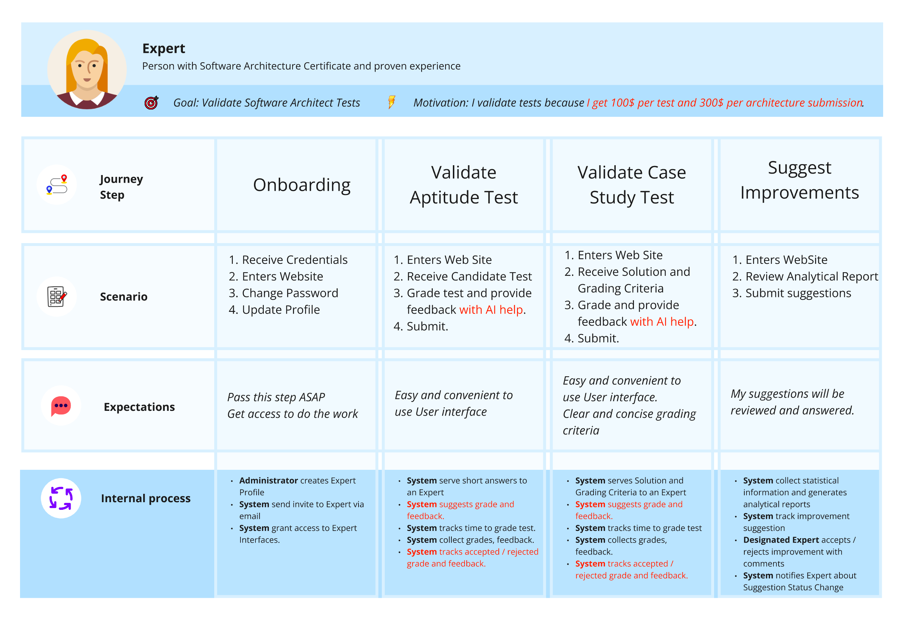
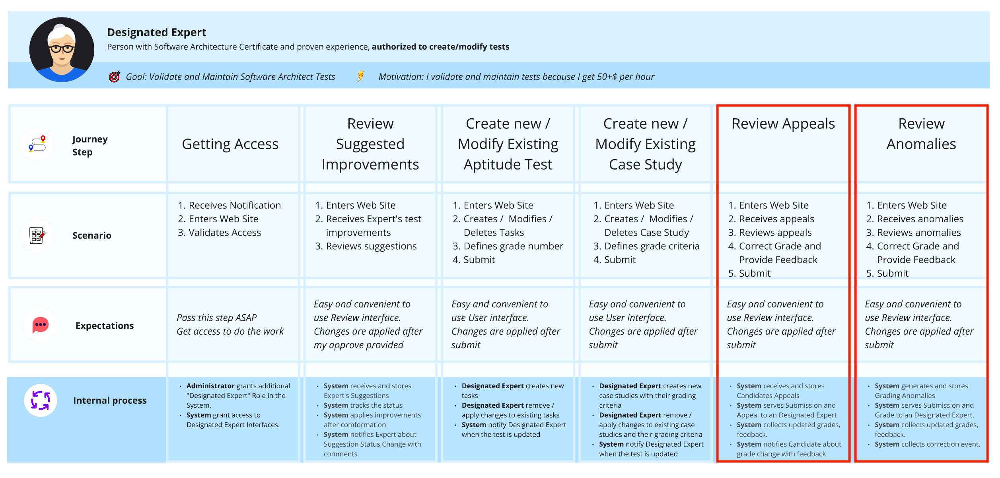
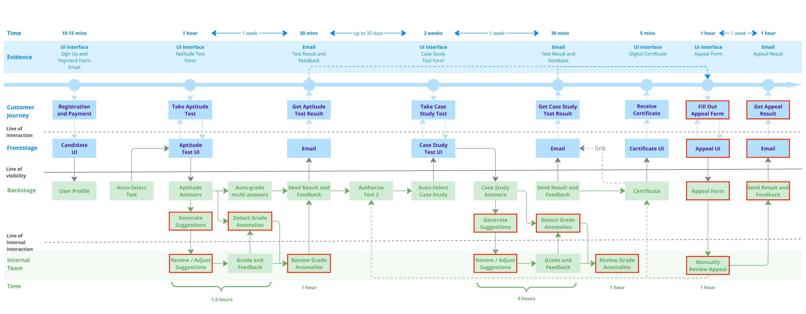

# The Software Architecture Guild Architectural Kata by O'Reilly, February 2025 <!-- omit in toc -->

## Team members <!-- omit in toc -->

- [Ilya Hardzeenka](https://www.linkedin.com/in/ilya-hardzeenka/)
- [Ksenia Bernat](https://www.linkedin.com/in/kseniya-bernat-342900104/)
- [Denis Klimenko](https://www.linkedin.com/in/den1sklimenko/)
- [Mikalai (Nick) Herman](https://www.linkedin.com/in/gekola/)
- [Oleg Zubchenko](https://www.linkedin.com/in/rgbd-me/)

## Document Structure

> [!TIP]
> **Introduction**\
> provides a welcome message and a brief overview of our way of working. It also introduces the *Business Case* and includes a link to the original requirements.
>
> **Current System Overview**\
> presents our interpretation of the system architecture, identifying key challenges and opportunities for improvement. A crucial part of this section is the *assumptions we made* due to gaps in available information.
>
> **Proposed Architecture**\
> outlines our solutions to the identified challenges and opportunities. It documents the *fundamental decisions* necessary for the successful implementation of these changes. The section continues with a *High-Level Architecture* that integrates AI solutions into the existing system and detailed descriptions of the *AI solutions* themselves.
>
> **Final Words** speak for themselves ;)

## Table of Contents

- [Introduction](#introduction)
  - [Welcome](#welcome)
  - [Business Case](#business-case)
  - [Original requirements](#original-requirements)
- [Current System Overview](#current-system-overview)
  - [High Level Architecture](#high-level-architecture)
  - [Assumptions](#assumptions)
  - [Challenges and Opportunities](#challenges-and-opportunities)
- [Proposed Architecture](#proposed-architecture)
  - [Decisions](#decisions)
  - [High-Level Architecture](#high-level-architecture-1)
  - [Aptitude Test: Solution 1](#aptitude-test-solution-1)
  - [Aptitude Test: Solution 2](#aptitude-test-solution-2)
  - [Architecture Exam: Solution 3](#architecture-exam-solution-3)
  - [Architecture Exam: Solution 4](#architecture-exam-solution-4)
- [Final words](#final-words)

# Introduction

## Welcome

Welcome to the [Software Architecture Guild](https://software-architecture-guild.com/) Architectural Kata run by O'Reilly in February 2025.

We are the Software Architecture Guild — a group of seasoned software architects who have spent years working together, honing our craft, and developing a shared approach to software architecture. During this time, we leveled up our skills and learned invaluable lessons about what it takes to succeed in this field.

Our mission is to design and shape the foundation upon which software architectures evolve, AI-driven insights emerge, and intelligent solutions are built.

As architects, we understand the power and potential of AI to transform industries, drive efficiencies, and unlock new possibilities. We are at the forefront of designing, securing, and optimizing software ecosystems to fully leverage AI capabilities and create adaptive, scalable, and intelligent systems.

In our work we mainly utilize following techniques:

- [Viewpoints and Perspectives Framework by Rozanski,Woods](https://www.viewpoints-and-perspectives.info/)
- [C4 Modeling approach](https://c4model.com/)

## Business Case

### Background

Certifiable, Inc. is a recognized leader in software architecture certification, providing accredited certification to software architects primarily in the U.S. Due to recent regulatory changes, international markets including the U.K., Europe, and Asia now require software architects to be certified, significantly increasing the demand for certification services. With this anticipated expansion, Certifiable, Inc. is facing a substantial surge in certification requests—estimated to grow 5-10 times their current volume. The existing manual processes for test grading and certification management are proving to be inefficient and unsustainable at this scale.

Given this challenge, the company is exploring how Generative AI can be integrated into their current system to optimize operations, improve efficiency, and maintain high certification standards while managing cost constraints.

### Market Opportunity

The global demand for certified software architects is accelerating due to government regulations and industry requirements.

- **Market Size & Growth**: The U.S. alone has over 176,000 software architects, with 300,000 job openings. Internationally, the number of software architects is estimated to be around 600,000, and the industry is projected to grow by 21% over the next four years.
- **Revenue Potential**: Certifiable, Inc. currently processes *200 candidates per week* at a fixed certification cost of *$800*. With the expected increase in demand, this number could rise to *1,000-2,000 candidates weekly*, translating into an annual revenue increase from certification fees alone.
- **Competitive Advantage**: As the market leader, Certifiable, Inc. holds over 80% market acceptance in the U.S. and a dominant presence in international markets. Successfully implementing AI-driven automation will strengthen its position as the most efficient and reliable certification provider globally.

### Objective

The primary objective is to modernize the SoftArchCert system by leveraging Generative AI to streamline the certification process while maintaining accuracy, reliability, and cost-effectiveness.

### Key Goals

- **Enhance Efficiency**: Reduce manual workload by automating grading processes, candidate feedback, and test modifications.
- **Maintain Accuracy & Quality**: Ensure AI-driven grading maintains the high standards required for certification validity.
- **Scale Operations**: Support a five to tenfold increase in certification candidates without overwhelming human graders.
- **Ensure SLA Adherence & Global Expansion**: Maintain certification processing times and guarantee adherence to SLAs as candidate volume scales and operations expand internationally.
- **Cost Optimization**: Implement AI solutions that align with budget constraints while providing maximum efficiency.

### Stakeholders

Several key stakeholders will be impacted by this initiative:

#### Internal Stakeholders

- **Certifiable, Inc. Leadership**: Executive management responsible for strategic direction and investment in AI-driven improvements.
- **Software Architect Graders**: Expert software architects who grade aptitude tests and case studies; their workload and processes will be affected by AI-driven automation.
- **System Administrators**: Responsible for maintaining certification systems and implementing AI-enhanced features.
- **Technology Team**: Architects and developers responsible for integrating AI into the SoftArchCert system.

### External Stakeholders

- **Certification Candidates**: Software architects seeking certification who will experience a potentially faster, AI-enhanced grading process.
- **Accreditation Bodies (SALB & International Licensing Boards)**: Organizations responsible for maintaining certification integrity and compliance. Although not directly impacted by the AI-driven changes, they may exercise increased oversight to ensure that certification integrity and compliance standards are upheld. Any perceived decline in quality could trigger additional audits or adjustments to certification requirements.
- **Employers & Hiring Managers**: Companies that rely on Certifiable, Inc. certifications for hiring and verifying software architects. While not directly impacted by system changes, the accelerated certification process is expected to increase the number of qualified architects in the job market, facilitating recruitment and hiring. However, any decline in certification standards or trust could have the opposite effect—diminishing the value of certification as a reliable indicator of candidate competence.

By addressing these stakeholder needs and aligning with market opportunities, Certifiable, Inc. can ensure its continued dominance in the certification industry while meeting the demands of an expanding global market.

## Original requirements

For the original requirements please follow [Original Requirements](requirements/original_requirements.md)

# Current System Overview

## High Level Architecture

### Functional Viewpoint

> *Describes the system’s functional elements, their responsibilities, interfaces, and primary interactions*

Since we already have an established system, we believe the best way to describe its existing functionality is through User Journey Maps and a System Blueprint.

We have identified several personas who interact with the system and actively participate in the business process:

- **Candidate**
  A software architect seeking certification through Certifiable, Inc. Candidates must pass two tests: an aptitude test and an architecture submission. They rely on timely grading, accurate feedback, and certification validation to advance their careers.
- **Expert**
  An employed expert software architect responsible for grading certification exams and providing detailed feedback to candidates. They are freelance contractors paid per hour and play a crucial role in ensuring the integrity of the certification process.
- **Designated Expert**
  A senior expert software architect with additional responsibilities beyond grading. They have the authority to modify certification tests, create or update case studies, and ensure that certification standards evolve with industry practices.
- **Administrator**
  A Certifiable, Inc. staff member responsible for managing expert software architects, maintaining system access, and ensuring smooth certification operations. They oversee expert profiles, system credentials, and handle operational issues that may arise during the certification process.
- **External HR**
  Hiring managers and recruiters from various companies who rely on Certifiable, Inc.'s certifications to verify the qualifications of software architects. They use the certification database to validate credentials and make informed hiring decisions.

#### Candidate Journey Map

**Workflow:**

1. Registration & Payment – The candidate registers on the Certifiable, Inc. platform, fills out the registration form, confirms their email, and pays for the certification test to gain access to the aptitude test.
2. Aptitude Test (Test 1) – The candidate takes a timed multiple-choice and short-answer aptitude test. Multiple-choice questions are auto-graded, while expert software architects review short-answer responses.
3. Test Results & Eligibility – If the candidate scores 80% or higher, they receive an invitation to the architecture submission test. If they fail, they receive detailed feedback and must start the process from the beginning to reattempt.
4. Architecture Submission (Test 2) – The candidate downloads a case study, designs a software architecture solution, and submits their work within two weeks.
5. Evaluation & Feedback – Expert software architects review the submission, grade it based on set criteria, and provide feedback.
6. Certification & Verification – If the candidate passes both tests, they receive official certification, which is stored in the database for employer verification. If they fail, they can reapply for Test 2.

#### Expert Journey Map

**Workflow:**

1. Profile Setup & Access – The expert software architect is onboarded by Certifiable, Inc. and gains access to the grading system. They can update their profile and set availability.
2. Test 1 Grading (Aptitude Test) – Experts review and grade short-answer responses manually. They provide detailed feedback and ensure grading accuracy based on established evaluation criteria.
3. Test 2 Grading (Architecture Submission) – Experts assess architecture submissions based on predefined rubrics. They spend an average of 8 hours per submission, ensuring fair and precise evaluation. Experts offer candidates detailed explanations for incorrect answers, areas of improvement, and scoring justifications to help them understand their results.
4. Test & Case Study Improvements – Designated experts periodically analyze test performance, identify problematic questions, and propose modifications or new case studies to keep the certification process relevant.

#### Designated Expert Journey Map

A Designated Expert has all the responsibilities of a regular Expert Software Architect, including grading aptitude tests, reviewing architecture submissions, providing feedback, and contributing to certification system updates.

**Workflow:**

1. Getting Access – The designated expert receives elevated access role from the system administrator.
2. Review Suggested Improvements from Experts – They analyze feedback and improvement suggestions submitted by expert graders regarding test questions, case studies, and grading inconsistencies. They assess recurring issues in test performance data, such as frequently failed questions.
3. Maintain Tests - Based on expert feedback and industry advancements, designated experts update aptitude test questions. They remove outdated or problematic questions and introduce new ones to reflect emerging software architecture trends. Changes are tested to ensure balance and difficulty consistency across certification exams.
4. Maintain Case Studies - Designated experts develop new architecture case studies to prevent content leaks and ensure the certification process remains challenging and relevant. They modify existing case studies to incorporate modern design patterns, industry best practices, and evolving regulatory requirements. Outdated or redundant case studies are deleted to maintain a streamlined and effective certification process.

#### Service Blue Print

> *A **Service Blueprint** is a detailed visual representation of a service process, illustrating interactions between users, system components, and backend processes. It provides a structured framework for understanding how a service functions by mapping out key elements such as customer actions, employee roles, supporting systems, and process flows.*

**Key takeaways**:

1. Grading the Aptitude Test takes approximately 3 hours. This process involves two primary tasks: evaluating answers and providing comments for incorrect responses. Since no specific data is available, **we assume an equal time distribution of 50% for grading and 50% for feedback**.
2. Grading the Architecture Submission takes approximately 8 hours. This involves three key tasks: reviewing the candidate's submitted architecture, assessing it against predefined criteria, and writing detailed feedback. In the absence of precise data, **we assume an equal time distribution of 33% for understanding the submission, 33% for grading, and 33% for providing feedback**.
3. While reducing candidate wait times is possible, it is entirely dependent on the time required for test validation and grading. Therefore, wait time improvements cannot be addressed in isolation.

### Context Viewpoint

> *Describes the relationships, dependencies, and interactions between the system and its environment (the people, systems, and external entities with which it interacts).*

Detailed description of logical structure of the system can be found by in a [separate document](current_state/context_viewpoint/README.md). Here we will point out the most important aspects of current structure.

#### Level 2 - Container diagram - Certification Platform

> The Container diagram shows the high-level shape of the software architecture and how responsibilities are distributed across it. It also shows the major technology choices and how the containers communicate with one another

We propose a revised logical organization for the system, with slight modifications from the current structure. Our goal is to re-group components into the following categories to provide better clarity when explaining future system changes.

> [!NOTE]
> *If the existing structure differs from our assumptions, it will introduce a prerequisite implementation step before any proposed AI-related changes can be implemented. This step would involve aligning logical structure with the necessary structure to support AI integration.*

**Workflow:**

- **Candidate Space**\
  Responsible for interaction with Candidates. Includes Candidate Testing UI, Candidate Registration, Candidate Status, and Notification service. Here, Candidates can sign up, take tests, and receive notifications when test validation results are available.
- **Expert and Admin Space**\
  Responsible for handling interactions with Experts, Designated Experts, and Administrators. Here, Experts and Designated Experts can collaborate to create and modify existing Tests and Case Studies, as well as grade submitted tests and architecture solutions. Administrators and Experts can also manage Expert user profiles here.
- **Aptitude Test**\
  Service responsible for organizing the Aptitude Test process. It delivers the test to Candidates and accepts their answers. It automatically grades multiple-choice questions and presents short answers for manual grading. It also accepts grades and feedback submitted by Experts.
- **Architecture Solution Exam**\
  Service responsible for organizing the Case Study Test process. It randomly selects a Case Study for the Candidate and accepts their solution. It presents the submitted solution to the Expert for evaluation and accepts grades and feedback.
- **Certified Architects Public Space**\
  Service responsible for generating, storing, and distributing Certificates to Candidates and external HRs. It also generates a notification with the results of the Architecture Solution Exam and Certificate information.

In addition to the new structure, we have made one key assumption. There is no information on how experts' time is tracked, who reviews it, or how their salaries are managed. While accounting is not our primary focus, understanding the time spent by experts per test is crucial for the future changes we plan to introduce.

**We assume that experts submit the time spent along with the validated test or architecture submission**.

### Informational Viewpoint

> *Describes the way that the architecture stores, manipulates, manages, and distributes information.*

Understanding what data is stored and where is critical for any system, and especially relevant as we consider future AI-driven enhancements. Unfortunately, we have limited information about the data structures used in the system. The provided diagrams offer insights into the names of data objects and their relationships, but their exact contents remain unknown, requiring us to make assumptions.

> [!NOTE]
> *If the existing data model differs from our assumptions, it will introduce a prerequisite implementation step before any proposed AI-related changes can be implemented. This step would involve aligning the data model with the necessary structure to support AI integration.*

The diagram below represents our best estimation of what the data model should look like.

We will not describe every object in the diagram, but we will focus on two key ones:

- **Graded Aptitude test submission**: is a historical dataset, which contains following information:
  - Aptitude test questions as they were at the time of test validation
  - Multiple choice answers and grades
  - Short Answers, Grades and Expert Feedback
  - **We assume that Grade and Feedback are stored per each Question/Answer**
  - Expert ID and Time it took validate test and provide feedback

- **Graded Architecture submission**: is a historical dataset, which contains following information:
  - Case Study and Grading Criteria as they were at the time of test validation
  - Grades based on each Criteria and Expert Feedback
  - **We assume that Grade and Feedback are stored per each Criteria**
  - Expert ID and Time it took validate test and provide feedback

**We assume that data from these datasets is never deleted and contains submissions, grades, and feedback for 120,000 candidates** who have already completed the certification process.

### Cost Perspective

> *Evaluates the financial impact of architectural decisions, balancing implementation, operation, and scalability costs with business value.*

Candidates pay $800 per certification. The validation process alone takes 11 hours of an Expert’s time, who is compensated at $50 per hour, resulting in a $550 validation cost, which accounts for 68% of the test fee.

Additionally, there are other costs to consider, including hosting expenses, designated experts’ time for maintaining tests and case studies, and administrator salaries. While not all candidates will pass Test 1, potentially reducing average validation costs, relying on failure rates as a cost-saving strategy is not practical. Therefore, **we assume the full validation cost applies to every candidate** to ensure accurate financial planning.

### Quality Perspective

> *Focuses on ensuring the system meets defined Service Level Agreements (SLAs) by maintaining reliability, performance, accuracy, and user expectations.*

Here are the requirements provided:

- As a recognized leader in certification, accuracy of tests, case studies, and grading is fundamental and inaccurate grading can result in a
  candidate not getting or maintaining a job and can impact a candidate's career.
- Inaccurate or misleading certification exams and case studies can undermine the credibility of the company’s current standing in the
  marketplace, so accuracy of the certification process is vital for the success of the company.

Given the lack of additional information, we must make the **following assumptions**:

- **There are no existing quality control measures in place to ensure grading accuracy.**
- **There is no formal appeals process that allows candidates to challenge grading errors made by Experts.**

## Assumptions

- For the **3 hours** an Expert spends on **Aptitude Test validation**, we assume the time is evenly split: **50% for grading** and **50% for providing feedback**.

- For the **8 hours** an Expert spends on **Case Study validation**, we assume the time is evenly distributed: **33% for understanding the submission, 33% for grading, and 33% for providing feedback**.

- We assume the system **automatically tracks** the time an Expert spends on validating tests and **stores this information** in a designated location.

- We assume there is **no established retention period**, and the database **stores graded answers and architecture submissions** of **120,000 candidates** who have already completed the certification process.

- We assume that each created **Case Study** includes a comprehensive evaluation rubric, containing a detailed set of assessment criteria.

- We assume that for the Aptitude Test, the **Grade and Feedback** are recorded **for each Question/Answer**, whereas for the Case Study Test, they are recorded **for each Criterion**.

- We assume the **full validation cost of $550** applies to **every candidate**, regardless of pass or fail rates.

- We assume there are **no established quality control measures** to verify grading accuracy.

- We assume there is **no formal appeals process** that allows candidates to challenge grading errors made by Experts.

## Challenges and Opportunities

### Scalability is a Major Challenge

The company currently employs *300 Experts* to validate tests for *200 candidates per week*. Scaling up to *1,000 candidates per week* would require either *longer wait times* (which is unacceptable) or *hiring significantly more Experts*. Hiring more Experts would also necessitate additional *managerial roles and support staff* (e.g., Administrators, Accountants, HR personnel), further *increasing operational costs*. As a result, *the cost per test would continue to rise*, negatively impacting profitability.

<mark>**Opportunity: Investing in *automation* is essential to ensure the company's long-term viability**</mark>

### High Cost Model

Currently, the company spends *$550 per test validation*, which accounts for *68% of the $800 certification fee*. This is a *significant expense*, and the *primary cost driver* is the time spent by Experts on validation. Reducing validation time is *key to lowering costs*, and AI can play a major role in *optimizing productivity*.

<mark>**Opportunity: AI-driven productivity enhancements can significantly *reduce validation time*, leading to *lower costs per test* and increased *operational efficiency***</mark>

### Current Expert Compensation Model Discourages Efficiency

Experts are *paid per hour*, meaning there is *no incentive* for them to work faster or process more tests. AI assistance can only succeed *if Experts are motivated* to use it effectively.

A better approach would be a *per-test payment model* instead of hourly pay.

- Currently, grading an *Aptitude Test* takes *3 hours*, earning an Expert *$150* ($50 per hour).
- If AI-assisted grading *reduces validation time to 1.5 hours*, and we *pay $100 per test*, an Expert could validate *two tests in the same 3-hour period*, earning *$200 instead of $150*.
- At the same time, the *company’s cost per test* would decrease from *$150 to $100*, improving efficiency and profitability.

<mark>**Opportunity: Transitioning to a *per-test payment model* would incentivize Experts to work faster and maximize efficiency, benefiting both Experts and the company**</mark>

### High-Quality Expectations Limit Full Automation

Given the strict *accuracy and reliability requirements*, fully automating the grading process is *not viable*. A human *must remain in control* to make final grading decisions. Instead of *replacing Experts*, AI should function as an *assistant*, helping them *validate tests faster and with greater accuracy*.

<mark>**Requirement: AI should be used as an *expert assistant*, speeding up grading rather than replacing human decision-making**</mark>

### Lack of a Measurable Grading Quality Process

Despite high expectations for grading quality, there is *no formalized process to measure it*. Establishing a *quality baseline* is crucial before making system changes. Experts already make mistakes, and incorporating *candidate feedback loops* is essential for assessing grading accuracy. A *human-only baseline* must be established to *track improvements* as AI-assisted grading is introduced.

<mark>**Requirement: A *quality control process* must be implemented before system improvements, ensuring that grading accuracy can be measured and improved over time**</mark>

### No Defined Process for Tracking Validation Time

There is *no mention of how validation time is currently tracked*, yet it is a key efficiency metric for AI-assisted improvements. A proper *measurement system* must be put in place to ensure progress in *reducing validation time*.

<mark>**Requirement: *Tracking validation time* is critical for evaluating AI effectiveness and must be established before automation is introduced**</mark>

# Proposed Architecture

## Decisions

Before we dive into architectural proposals we need to align on fundamental decisions being made:

### [ADR 1:  AI/ML Development Principles](adrs/adr-1-principles.md)

AI/ML development within our architecture must adhere to the following principles:

- **Multiple AI/ML solutions must be developed in parallel** rather than assuming a single model will be optimal.
- **Real-world testing must validate reliability**, using empirical performance data to select the most effective solution.
- **Iterative evaluation and refinement must continuously** ensure that models evolve based on actual usage conditions.
- **Decisions on model selection should be data-driven**, prioritizing solutions that demonstrate superior real-world effectiveness.
- **Fallback mechanisms should be in place**, allowing for seamless transitions if a model underperforms or becomes unreliable over time.

Embedding these principles into our AI/ML development lifecycle ensures we make data-driven, real-world-validated decisions while maintaining adaptability and resilience against unforeseen challenges.

### [ADR 2: Current Expert Compensation Model Discourages Efficiency](adrs/adr-2-compensation-model.md)

To encourage efficiency and align expert compensation with performance, the following changes are proposed:

- **Transition from an hourly compensation model to a per-evaluation payment structure**, ensuring experts are rewarded based on completed reviews rather than time spent.
- **Introduce performance-based incentives**, providing bonuses for experts who consistently deliver high-quality, accurate, and timely evaluations.
- **Encourage AI-assisted grading**, allowing experts to use automated tools to accelerate their work while maintaining oversight and accuracy.

Implementing this new compensation model will significantly improve efficiency, scalability, and sustainability while ensuring grading remains accurate and fair.

### [ADR 3: AI/ML as an Assistant, Not a Fully Automated System](adrs/adr-3-assistant-only.md)

AI/ML usage within our system will adhere to the following principles:

- **AI/ML will only function as an assistant**, never as a fully automated decision-maker.
- **Experts will retain full control over all grading and certification decisions**, with AI/ML acting in a supportive role.
- **AI-generated recommendations will require human validation** before being acted upon.
- **Transparency in AI suggestions must be maintained**, ensuring that experts understand how recommendations are derived.
- **AI-assisted tools should focus on increasing efficiency** rather than replacing human expertise.

By embedding these principles, we ensure that AI remains a **trusted assistant** rather than an autonomous decision-maker, preserving the credibility and quality of our certification process.

### [ADR 4: Implementing a Quality Control Process Before System Improvements](adrs/adr-4-quality-control.md)

To maintain high standards of accuracy and reliability, the following quality control measures will be implemented:

- **Anomaly Detection Process**: Validate grades against similar past submissions to identify and correct deviations, ensuring consistency in grading standards.
- **Introduce Appeal Process**: Implement a structured process allowing candidates to formally contest grades, capturing potential false negative errors and ensuring fairness.
- **Baseline Performance Metrics**: Establish a benchmark for current expert grading accuracy and consistency to compare against future performance.
- **Quality Audits**: Regular reviews of expert grading accuracy to identify inconsistencies, ensure adherence to defined evaluation criteria, and identify those needing additional training or recalibration.

By establishing a rigorous quality control process, we ensure that all future system enhancements are backed by empirical data, improve expert grading accuracy, and uphold the credibility of our certification program.

### [ADR 5: Measure Validation Time to Assess AI Effectiveness](adrs/adr-5-performance-control.md)

To assess AI effectiveness in validation processes, the following measures will be implemented:

- **Track Expert Validation Time**: We assume that expert validation time tracking is already in place. If not, it should be implemented to measure how long experts spend grading each submission.
- **Establish Baseline Metrics**: Capture pre-automation validation times to compare against AI-assisted workflows.
- **Monitor AI Impact on Efficiency**: Regularly evaluate whether AI reduces validation time while maintaining grading quality.
- **Optimize Processes Based on Data**: Use time measurement insights to refine AI models and improve overall efficiency.

By measuring validation time, we establish a concrete framework for assessing AI effectiveness, ensuring automation leads to real efficiency gains without compromising grading quality.

## High-Level Architecture

As stated in ADRs, in order to enable AI implementation within the system we need to add several new processes and functionalities to the system:

- **Detect Grade Anomalies:** Identifies inconsistencies in grading by comparing new grades against historical data to detect deviations that require expert review.

- **Candidate Appeal Process:** Allows candidates to formally challenge their grades, ensuring a structured review process to identify and correct potential grading errors.

- **Suggestions Generation Process:** Uses AI or predefined rules to provide recommendations to experts, assisting in grading decisions, feedback generation, and test modifications.

- **Quality Measurement Process:** Evaluates the accuracy and consistency of grading by tracking expert performance, candidate feedback, and statistical deviations.

- **Effectiveness Measurement Process:** Assesses the impact of AI and process improvements by tracking validation time, expert workload reduction, and overall grading accuracy.

Implementation details for those processes can be found in the architectural viewpoints below.

### Functional Viewpoint

> *Describes the system’s functional elements, their responsibilities, interfaces, and primary interactions*

#### Candidate Journey Map

**Changes**:

1. **File an Appeal Process (New Step)**
   - Candidate accesses the website.
   - Candidate fills out the appeal form.
   - Candidate submits the appeal request.
   - System receives and stores the appeal request.
   - System sends a confirmation email with an estimated appeal review time.

2. **Get the Appeal Result Process (New Step)**
   - Designated Expert is notified of the appeal.
   - Designated Expert reviews the submitted test.
   - Designated Expert re-evaluates the test based on appeal criteria.
   - System collects corrected grades and feedback.
   - System recalculates the total score based on the review.
   - System updates candidate records if necessary.
   - System sends an email to the candidate with the appeal result.
   - If the appeal is successful, the system grants access to the next test or issue a certificate.

#### Expert Journey Map

**Changes**:

1. **AI Assistance in Grading (Added Feature)**
   - AI-generated grade and feedback suggestions are now provided for both the **Aptitude Test** and **Case Study Test** validation processes.
   - Experts can review and either accept or reject AI-suggested grades and feedback.
   - The system tracks expert decisions on AI-suggested grades and feedback.

#### Designated Expert Journey Map

**Changes**:

1. **Review Appeals (New Step)**
   - Designated Expert accesses the appeals review system.
   - System serves candidate appeals for review.
   - Designated Expert reviews appeal details.
   - Designated Expert corrects grades and provides feedback.
   - System updates candidate records with the revised grade and feedback.
   - System notifies the candidate about the appeal result.

2. **Review Anomalies (New Step)**
   - System generates and stores grading anomalies.
   - System serves detected grading anomalies to the Designated Expert.
   - Designated Expert reviews anomalies in test grading.
   - Designated Expert corrects grades and provides feedback if necessary.
   - System updates records with corrected grades.

#### Service Blue Print

> *A **Service Blueprint** is a detailed visual representation of a service process, illustrating interactions between users, system components, and backend processes. It provides a structured framework for understanding how a service functions by mapping out key elements such as customer actions, employee roles, supporting systems, and process flows.*

**Changes**:

1. **Appeal Process (New Steps)**
   - **Fill Out Appeal Form**
     - Candidate accesses the Appeal UI.
     - Candidate fills out and submits the appeal form.
     - System stores the appeal request.

   - **Get Appeal Result**
     - System processes the appeal request.
     - Designated Expert manually reviews the appeal.
     - System updates the grade and feedback based on the review.
     - Candidate receives an email with the appeal result.

2. **AI-Assisted Grading Enhancements**
   - **Generate Suggestions**
     - AI generates grading and feedback suggestions for both Aptitude and Case Study tests.

   - **Review / Adjust Suggestions**
     - Experts review AI-generated grading suggestions.
     - Experts accept or modify suggestions before submission.

   - **Detect Grade Anomalies**
     - System identifies potential inconsistencies in grading.
     - Anomalies are flagged for expert review.

   - **Review Grade Anomalies**
     - Designated Experts review flagged grading anomalies.
     - Experts adjust grades if necessary before final submission.

### Context Viewpoint

> *Describes the relationships, dependencies, and interactions between the system and its environment (the people, systems, and external entities with which it interacts).*

In this viewpoint we will only highlight changes made to [Current State architecture](current_state/context_viewpoint/README.md).\
Detailed description of all changes to the system can be found by in a [separate document](future_state/context_viewpoint/README.md).

#### Level 2 - Container diagram - Certification Platform

> The Container diagram shows the high-level shape of the software architecture and how responsibilities are distributed across it. It also shows the major technology choices and how the containers communicate with one another

**Changes:**

1. Introduced **AI Assistant** with several functions:
   - Store historical records for all tests, candidate submissions, their grades and feedback, and the time experts spend grading.
   - Generate suggestions that experts can accept or reject when grading submissions.
   - Collect suggestions status to calculate suggestions performance and adjust the AI Assistant accordingly.
   - Detect anomalies and notify the designated expert for review.
   - Collect anomalies and appeals status to calculate grading quality.

2. Introduced a **new appeal process**:
   - Candidates can raise an appeal.
   - Designated experts review appeals and make necessary corrections.

#### Level 3 - Components - AI Assistant

We propose implementing the **AI Assistant** using a **Micro-Kernel Architecture**.

The **Core Component** will act as the **central aggregator and integrator** for AI-based suggestion generators. It will include:

- A **User Interface** for **AI Engineers** to manage and refine AI solutions.
- A **Suggestions Database** to store AI-generated grading recommendations.
- An **API** to serve AI-generated suggestions to the **Expert UI** during the grading process.

Each AI-powered grading solution will:

- Access **historical grading data** from a shared **common storage**.
- Provide an **API** for AI Engineers to adjust and refine the grading model.
- Populate the **Suggestions Database** in a standardized format, ensuring consistency across different solutions.

AI Analytics will:

- Analyze graded submissions to detect anomalies
- Calculate Validation Quality and Performance metrics

This approach enables the use of multiple suggestion generators simultaneously and allows for seamless replacement if any solution proves ineffective.

**Workflow:**

1. **Data Loading**:
   - The system loads candidate submissions, grading criteria, and historical grading data from:
     - Aptitude Test (Multiple-choice and short-answer responses)
     - Architecture Solution Exam (Case study submissions, grading rubrics)
   - Retrieves past expert grading decisions, feedback records, and grading time logs for AI model refinement.

2. **Generating AI-Based Grading Suggestions**:
   - Each Aptitude Test Solution and Architecture Exam Solution processes:
     - Candidate responses (short answers, architecture submissions)
     - Predefined grading criteria and rubrics
     - Past grading patterns from experts
   - AI-driven models generate suggested grades and feedback.
   - Suggestions, confidence scores, and AI-extracted rationales are stored in AI Core.

3. **Serving AI Suggestions to Experts**:
   - AI Core delivers grading suggestions to Expert Grading Space.
   - Experts see AI-generated grades, explanations, and confidence scores.
   - Experts can review, accept, or modify AI-generated grades before submission.

4. **Expert Feedback on AI Suggestions**:
   - Experts approve or override AI-generated suggestions.
   - System logs expert feedback, including:
     - Accepted/rejected suggestions
     - Adjustments made to grades
     - Time spent reviewing AI-generated inputs
   - This feedback is stored in AI Core as suggestions status.

5. **AI Performance Tracking & Continuous Improvement**:
   - AI Engineers track suggestion accuracy, expert modifications, and confidence vs. rejection rates.
   - AI models are fine-tuned based on real expert corrections.

6. **Anomaly Detection & Expert Review**:
   - AI Analytics App analyzes historical grading trends and real-time grading activities.
   - Detects grading inconsistencies, outliers, and suspicious patterns.
   - Flags cases where:
     - AI suggestions deviate significantly from expert decisions.
     - Experts inconsistently apply grading rubrics.
   - Anomalies are sent to Expert Admin Space for manual review and intervention.

7. **Quality & Time Performance Metrics Calculation**:
   - AI Analytics App stores:
     - Anomalies and appeal statuses
     - Accuracy metrics for AI-suggested grades
     - Turnaround time for expert grading and appeals
   - Quality statistics (grading consistency, rubric adherence) and performance metrics (average grading time, bottlenecks) are calculated.
   - AI Analytics App serve all metrics to the Core App.

8. **Continuous AI Model Enhancement**:
   - AI Engineers analyze:
     - Grading quality trends
     - Time performance efficiency
     - Expert rejection/modification trends on AI suggestions
   - Necessary refinements are made to AI models:
     - Updating AI-generated grading criteria
     - Fine-tuning confidence thresholds for suggestions
     - Adjusting AI learning patterns based on expert corrections
   - AI models are retrained periodically for improved accuracy and efficiency.

### Informational Viewpoint

> *Describes the way that the architecture stores, manipulates, manages, and distributes information.*

### Operational Viewpoint

> *Describes how the system will operate to fulfill the required functionality.*

## Aptitude Test: Solution 1

### Architecture

Diagrams + ADRs

### Implementation Milestones

## Aptitude Test: Solution 2

### Architecture

Diagrams + ADRs

### Implementation Milestones

## Architecture Exam: Solution 3

### Architecture

Diagrams + ADRs

### Implementation Milestones

## Architecture Exam: Solution 4

### Architecture

Diagrams + ADRs

### Implementation Milestones

# Final words
