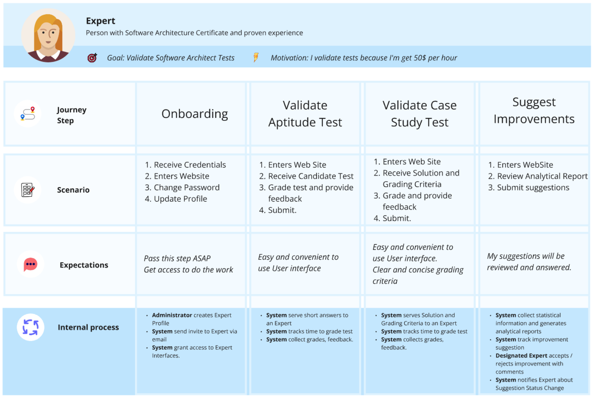
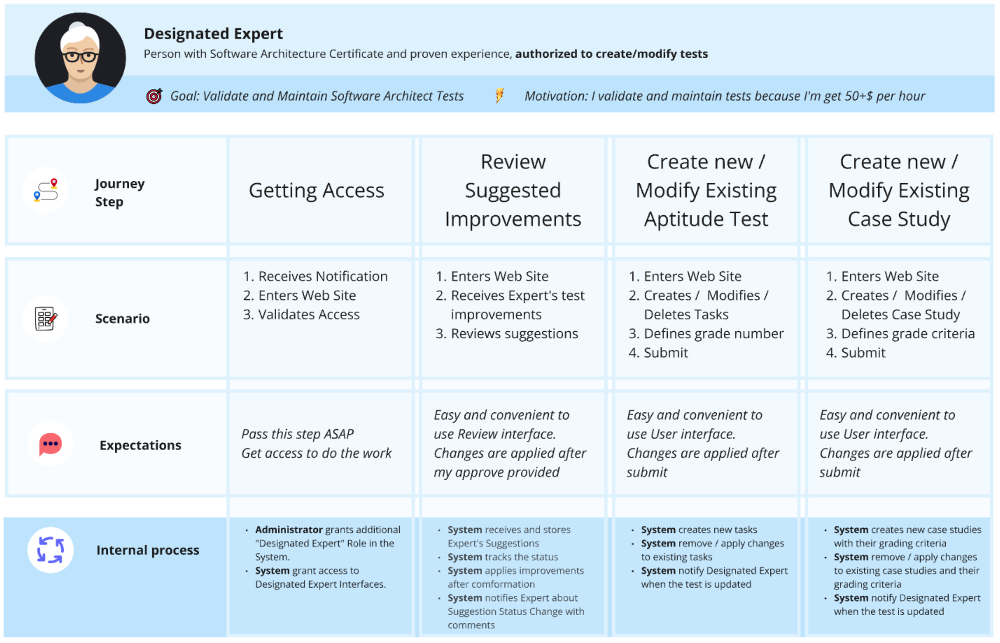

# The Software Architecture Guild Architectural Kata by O'Reilly, February 2025

## Team members

- [Ilya Hardzeenka](https://www.linkedin.com/in/ilya-hardzeenka/)
- [Ksenia Bernat](https://www.linkedin.com/in/kseniya-bernat-342900104/)
- [Denis Klimenko](https://www.linkedin.com/in/den1sklimenko/)
- [Mikalai (Nick) Herman](https://www.linkedin.com/in/gekola/)
- [Oleg Zubchenko](https://www.linkedin.com/in/rgbd-me/)

## Table of Contents

## Welcome

Welcome to the [Software Architecture Guild](https://software-architecture-guild.com/) Architectural Kata run by O'Reilly in February 2025.

We are the Software Architecture Guild — a group of seasoned software architects who have spent years working together, honing our craft, and developing a shared approach to software architecture. During this time, we leveled up our skills and learned invaluable lessons about what it takes to succeed in this field.

Our mission is to design and shape the foundation upon which software architectures evolve, AI-driven insights emerge, and intelligent solutions are built.

As architects, we understand the power and potential of AI to transform industries, drive efficiencies, and unlock new possibilities. We are at the forefront of designing, securing, and optimizing software ecosystems to fully leverage AI capabilities and create adaptive, scalable, and intelligent systems.

In our work we mainly utilize following techniques:

- [Viewpoints and Perspectives Framework by Rozanski,Woods](https://www.viewpoints-and-perspectives.info/)
- [C4 Modeling approach](https://c4model.com/)

## Business Case

### Background

Certifiable, Inc. is a recognized leader in software architecture certification, providing accredited certification to software architects primarily in the U.S. Due to recent regulatory changes, international markets including the U.K., Europe, and Asia now require software architects to be certified, significantly increasing the demand for certification services. With this anticipated expansion, Certifiable, Inc. is facing a substantial surge in certification requests—estimated to grow 5-10 times their current volume. The existing manual processes for test grading and certification management are proving to be inefficient and unsustainable at this scale.

Given this challenge, the company is exploring how Generative AI can be integrated into their current system to optimize operations, improve efficiency, and maintain high certification standards while managing cost constraints.

### Market Opportunity

The global demand for certified software architects is accelerating due to government regulations and industry requirements.

- **Market Size & Growth**: The U.S. alone has over 176,000 software architects, with 300,000 job openings. Internationally, the number of software architects is estimated to be around 600,000, and the industry is projected to grow by 21% over the next four years.
- **Revenue Potential**: Certifiable, Inc. currently processes *200 candidates per week* at a fixed certification cost of *$800*. With the expected increase in demand, this number could rise to *1,000-2,000 candidates weekly*, translating into an annual revenue increase from certification fees alone.
- **Competitive Advantage**: As the market leader, Certifiable, Inc. holds over 80% market acceptance in the U.S. and a dominant presence in international markets. Successfully implementing AI-driven automation will strengthen its position as the most efficient and reliable certification provider globally.

### Objective

The primary objective is to modernize the SoftArchCert system by leveraging Generative AI to streamline the certification process while maintaining accuracy, reliability, and cost-effectiveness.

#### Key Goals

- **Enhance Efficiency**: Reduce manual workload by automating grading processes, candidate feedback, and test modifications.
- **Maintain Accuracy & Quality**: Ensure AI-driven grading maintains the high standards required for certification validity.
- **Scale Operations**: Support a five to tenfold increase in certification candidates without overwhelming human graders.
- **Cost Optimization**: Implement AI solutions that align with budget constraints while providing maximum efficiency.

### Stakeholders

Several key stakeholders will be impacted by this initiative:

#### Internal Stakeholders

- **Certifiable, Inc. Leadership**: Executive management responsible for strategic direction and investment in AI-driven improvements.
- **Software Architect Graders**: Expert software architects who grade aptitude tests and case studies; their workload and processes will be affected by AI-driven automation.
- **System Administrators**: Responsible for maintaining certification systems and implementing AI-enhanced features.
- **Technology Team**: Architects and developers responsible for integrating AI into the SoftArchCert system.

### **External Stakeholders**

- **Certification Candidates**: Software architects seeking certification who will experience a potentially faster, AI-enhanced grading process.
- **Accreditation Bodies (SALB & International Licensing Boards)**: Organizations responsible for maintaining certification integrity and compliance.
- **Employers & Hiring Managers**: Companies that rely on Certifiable, Inc. certifications for hiring and verifying software architects.

By addressing these stakeholder needs and aligning with market opportunities, Certifiable, Inc. can ensure its continued dominance in the certification industry while meeting the demands of an expanding global market.

### Original requirements

For the original requirements please follow [Original Requirements](requirements/original_requirements.md)

## Current System Overview

### Functional Viewpoint

> *Describes the system’s functional elements, their responsibilities, interfaces,
> and primary interactions*

Since we already have an established system, we believe the best way to describe its existing functionality is through User Journey Maps and a System Blueprint.

We have identified several personas who interact with the system and actively participate in the business process:

- **Candidate**
  A software architect seeking certification through Certifiable, Inc. Candidates must pass two tests: an aptitude test and an architecture submission. They rely on timely grading, accurate feedback, and certification validation to advance their careers.
- **Expert**
  An employed expert software architect responsible for grading certification exams and providing detailed feedback to candidates. They are freelance contractors paid per hour and play a crucial role in ensuring the integrity of the certification process.
- **Designated Expert**
  A senior expert software architect with additional responsibilities beyond grading. They have the authority to modify certification tests, create or update case studies, and ensure that certification standards evolve with industry practices.
- **Administrator**
  A Certifiable, Inc. staff member responsible for managing expert software architects, maintaining system access, and ensuring smooth certification operations. They oversee expert profiles, system credentials, and help facilitate AI-driven enhancements.
- **External HR**
  Hiring managers and recruiters from various companies who rely on Certifiable, Inc.'s certifications to verify the qualifications of software architects. They use the certification database to validate credentials and make informed hiring decisions.

#### Candidate Journey Map

1. Registration & Application – The candidate registers on the Certifiable, Inc. platform and submits an application for certification.
2. Aptitude Test (Test 1) – The candidate takes a timed multiple-choice and short-answer aptitude test. Multiple-choice questions are auto-graded, while expert software architects review short-answer responses.
3. Test Results & Eligibility – If the candidate scores 80% or higher, they receive an invitation to the architecture submission test. If they fail, they receive detailed feedback and can reattempt.
4. Architecture Submission (Test 2) – The candidate downloads a case study, designs a software architecture solution, and submits their work within two weeks.
5. Evaluation & Feedback – Expert software architects review the submission, grade it based on set criteria, and provide feedback.
6. Certification & Verification – If the candidate passes both tests, they receive official certification, which is stored in the database for employer verification. If they fail, they can reapply for Test 2.

#### Expert Journey Map

1. Profile Setup & Access – The expert software architect is onboarded by Certifiable, Inc. and gains access to the grading system. They can update their profile and set availability.
2. Test 1 Grading (Aptitude Test) – Experts review and grade short-answer responses manually. They provide detailed feedback and ensure grading accuracy based on established evaluation criteria.
3. Test 2 Grading (Architecture Submission) – Experts assess architecture submissions based on predefined rubrics. They spend an average of 8 hours per submission, ensuring fair and precise evaluation. Experts offer candidates detailed explanations for incorrect answers, areas of improvement, and scoring justifications to help them understand their results.
4. Test & Case Study Improvements – Designated experts periodically analyze test performance, identify problematic questions, and propose modifications or new case studies to keep the certification process relevant.

#### Designated Expert Journey Map

A Designated Expert has all the responsibilities of a regular Expert Software Architect, including grading aptitude tests, reviewing architecture submissions, providing feedback, and contributing to certification system updates.

1. Getting Access – The designated expert receives elevated access role from the system administrator.
2. Review Suggested Improvements from Experts – They analyze feedback and improvement suggestions submitted by expert graders regarding test questions, case studies, and grading inconsistencies. They assess recurring issues in test performance data, such as frequently failed questions.
3. Maintain Tests - Based on expert feedback and industry advancements, designated experts update aptitude test questions. They remove outdated or problematic questions and introduce new ones to reflect emerging software architecture trends. Changes are tested to ensure balance and difficulty consistency across certification exams.
4. Maintain Case Studies - Designated experts develop new architecture case studies to prevent content leaks and ensure the certification process remains challenging and relevant. They modify existing case studies to incorporate modern design patterns, industry best practices, and evolving regulatory requirements. Outdated or redundant case studies are deleted to maintain a streamlined and effective certification process.

#### Service Blue Print

> *A **Service Blueprint** is a detailed visual representation of a service process, illustrating interactions between users, system components, and backend processes. It provides a structured framework for understanding how a service functions by mapping out key elements such as customer actions, employee roles, supporting systems, and process flows.*

**Key takeaways**:

1. Grading the Aptitude Test takes approximately 3 hours. This process involves two primary tasks: evaluating answers and providing comments for incorrect responses. Since no specific data is available, **we assume an equal time distribution of 50% for grading and 50% for feedback**.
2. Grading the Architecture Submission takes approximately 8 hours. This involves three key tasks: reviewing the candidate's submitted architecture, assessing it against predefined criteria, and writing detailed feedback. In the absence of precise data, **we assume an equal time distribution of 33% for understanding the submission, 33% for grading, and 33% for providing feedback**.
3. While reducing candidate wait times is possible, it is entirely dependent on the time required for test validation and grading. Therefore, wait time improvements cannot be addressed in isolation.

## Proposed Solutions

### Solution 1

#### Architecture

Diagrams + ADRs

#### Implementation Milestones

### Solution 2

#### Architecture

Diagrams + ADRs

#### Implementation Milestones

### Solution 3

#### Architecture

Diagrams + ADRs

#### Implementation Milestones

## Final words
