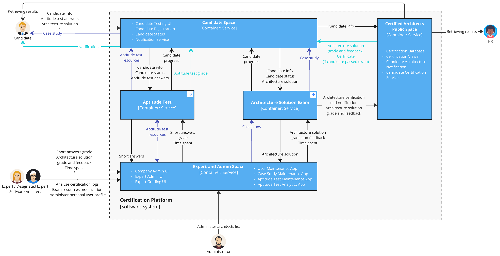
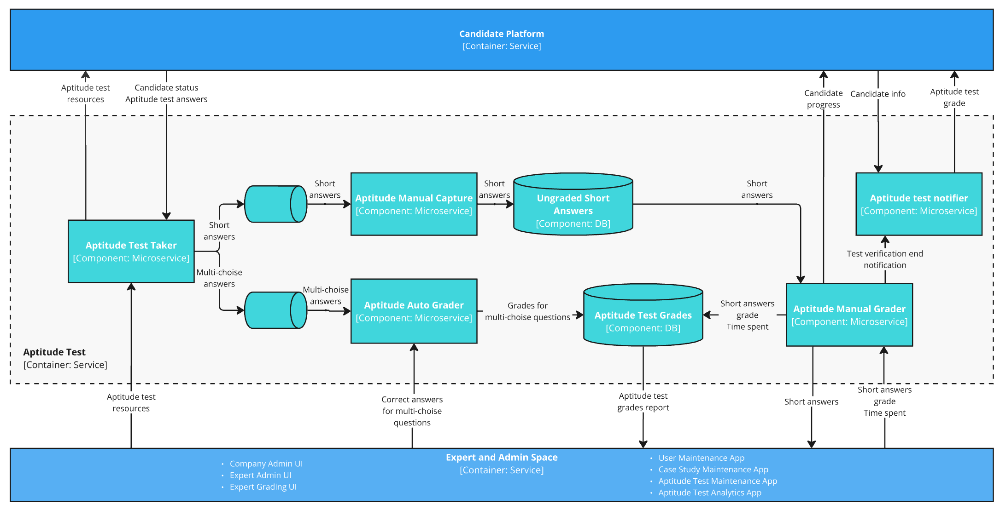

# Context Viewpoint <!-- omit in toc -->

> Describes the relationships, dependencies, and interactions between the system and its environment (the people, systems, and external entities with which it interacts).

## Table of Contents <!-- omit in toc -->

- [Level 1 - System Context](#level-1---system-context)
- [Level 2 - Container diagram - Certification Platform](#level-2---container-diagram---certification-platform)
- [Level 3 - Components](#level-3---components)
  - [Level 3 - Components - Candidate Space](#level-3---components---candidate-space)
  - [Level 3 - Components - Expert and Admin Space](#level-3---components---expert-and-admin-space)
  - [Level 3 - Components - Aptitude Test](#level-3---components---aptitude-test)
  - [Level 3 - Components - Architecture Solution Exam](#level-3---components---architecture-solution-exam)
  - [Level 3 - Components - Certification Space](#level-3---components---certification-space)

## Level 1 - System Context

> A System Context Diagram is a high-level visual representation that depicts a system or software application in its broader context. It illustrates how the system interacts with external entities, such as users, other systems, or data sources.

As we can see, the system is interacting only with people:

- **Candidate**
  A software architect seeking certification through Certifiable, Inc. Candidates must pass two tests: an aptitude test and an architecture submission. They rely on timely grading, accurate feedback, and certification validation to advance their careers.
- **Expert**
  An employed expert software architect responsible for grading certification exams and providing detailed feedback to candidates. They are freelance contractors paid per hour and play a crucial role in ensuring the integrity of the certification process.
- **Designated Expert**
  A senior expert software architect with additional responsibilities beyond grading. They have the authority to modify certification tests, create or update case studies, and ensure that certification standards evolve with industry practices.
- **Administrator**
  A Certifiable, Inc. staff member responsible for managing expert software architects, maintaining system access, and ensuring smooth certification operations. They oversee expert profiles, system credentials, and help facilitate AI-driven enhancements.
- **External HR**
  Hiring managers and recruiters from various companies who rely on Certifiable, Inc.'s certifications to verify the qualifications of software architects. They use the certification database to validate credentials and make informed hiring decisions.

## Level 2 - Container diagram - Certification Platform

> The Container diagram shows the high-level shape of the software architecture and how responsibilities are distributed across it. It also shows the major technology choices and how the containers communicate with one another

We propose a revised logical organization for the system, with slight modifications from the current structure. Our goal is to re-group components into the following categories to provide better clarity when explaining future system changes:

- **Candidate Space**
  Responsible for interaction with Candidates. Includes Candidate Testing UI, Candidate Registration, Candidate Status, and Notification service. Here, Candidates can sign up, take tests, and receive notifications when test validation results are available.
- **Expert and Admin Space**
  Responsible for handling interactions with Experts, Designated Experts, and Administrators. Here, Experts and Designated Experts can collaborate to create and modify existing Tests and Case Studies, as well as grade submitted tests and architecture solutions. Administrators and Experts can also manage Expert user profiles here.
- **Aptitude Test**
  Service responsible for organizing the Aptitude Test process. It delivers the test to Candidates and accepts their answers. It automatically grades multiple-choice questions and presents short answers for manual grading. It also accepts grades and feedback submitted by Experts.
- **Architecture Solution Exam**
  Service responsible for organizing the Case Study Test process. It randomly selects a Case Study for the Candidate and accepts their solution. It presents the submitted solution to the Expert for evaluation and accepts grades and feedback.
- **Certified Architects Public Space**
  Service responsible for generating, storing, and distributing Certificates to Candidates and external HRs. It also generates a notification with the results of the Architecture Solution Exam and Certificate information.

## Level 3 - Components

> The Component diagram shows how a container is made up of a number of "components", what each of those components are, their responsibilities and the technology/implementation details.

### Level 3 - Components - Candidate Space

The diagram illustrates the **Candidate Space** and its interaction with various services involved in the certification process for software architects. It showcases how candidates interact with the system through a web application and how their progress is managed.

The **Candidate Testing UI (Component: Web App)** serves as the central interface where candidates provide their information, submit aptitude test answers, and upload architecture solutions.

#### Workflow

Step 1: Candidate Registration

- The **Candidate Registration (Microservice)** collects and stores candidate details.
- Candidate information is sent to the **Candidate Testing UI** for authentication and tracking.

Step 2: Aptitude Test Interaction

- The **Candidate Testing UI** provides aptitude test resources to the candidate.
- Candidates submit their **aptitude test answers**, which are sent to the **Aptitude Test (Container: Service)**.
- The **Candidate Status (Microservice)** tracks candidate progress throughout the test-taking process.
- Once grading is complete, the **Aptitude Test** service returns the aptitude test grade to the **Notification Service**, which then informs the candidate.

Step 3: Case Study Assignment

- If the candidate passes the aptitude test, they receive a **case study** from the **Candidate Testing UI**.
- The **Candidate Status (Microservice)** updates the candidate’s progress and sends the case study to the **Architecture Solution Exam (Container: Service)**.

Step 4: Architecture Solution Submission

- The candidate submits the **architecture solution** through the **Candidate Testing UI**.
- The submission is sent to the **Architecture Solution Exam (Container: Service)** for grading.

Step 5: Certification and Notifications

- The **Architecture Solution Exam** processes the submission and returns the **grade and feedback**.
- If the candidate passes, the certification details are stored in the **Certified Architects Public Space (Container: Service)** for public verification.
- The **Notification Service (Microservice)** sends updates on the candidate’s test results and certification status.

The system ensures a seamless process for candidates from registration to certification, tracking progress at each stage while integrating automated and manual grading mechanisms.

### Level 3 - Components - Expert and Admin Space

The diagram illustrates the **Expert and Admin Space**, which supports the certification process by allowing experts and administrators to manage exams, grading, and certification logs. The architecture is divided into multiple sections, including expert administration, grading, and overall maintenance. The system ensures an efficient process for maintaining certification standards, analyzing test performance, and allowing expert-driven updates to exam content.

#### Workflow

Step 1: Administrative Functions

- The **User Maintenance App (Microservice)** manages architect profiles and credentials.
- The **Company Admin UI (Component: Web App)** allows administrators to manage expert software architects and certification records.

Step 2: Expert Administration

- The **Expert Admin UI (Component: Web App)** allows experts to analyze certification logs, modify exam resources, and administer user profiles.
- The **Case Study Test Maintenance App (Microservice)** is used to modify case studies and grading criteria (restricted to designated experts).
- The **Aptitude Test Maintenance App (Microservice)** enables modifications to aptitude test questions.

Step 2: Database Management

- The **Case Study Database (Component: DB)** stores case studies and grading criteria.
- The **Aptitude Test Database (Component: DB)** contains aptitude test resources and maintains records of test performance.

Step 3: Expert Grading Process

- The **Aptitude Test (Container: Service)** receives short answers from candidates.
- Short answers are sent to the **Expert Grading UI (Component: Web App)** for evaluation by software architects.
- The **Architecture Solution Exam (Container: Service)** processes case study submissions and forwards them for expert review.
- Experts manually grade short-answer responses and architecture solutions, providing detailed feedback.
- Experts submit the time spent validating a test along with the validated test itself.

Step 4: Certification Review & Reporting

- The **Aptitude Test Analysis App (Microservice)** generates reports on test grading and performance trends.
- Experts analyze certification logs to improve test accuracy and relevance.

### Level 3 - Components - Aptitude Test

This diagram represents the **Aptitude Test** process, which is the **first stage** of the certification process for software architects. It illustrates the workflow for test retrieval, answers submission, grading, and notification.

#### Workflow

The aptitude test process follows a structured step-by-step approach.

Step 1: Candidate Takes the Aptitude Test

- The candidate begins the aptitude test, which consists of:
  - **Multiple-choice questions** (automatically graded).
  - **Short-answer questions** (manually graded by expert software architects).
- The **Aptitude Test Taker (Microservice)** collects and processes the candidate’s responses.
- The responses are stored in two databases:
  - **Ungraded Short Answers (DB)** for manual grading.
  - **Aptitude Test Grades (DB)** for automatically graded multiple-choice answers.

Step 2: Automated Grading for Multiple-Choice Questions

- The **Aptitude Auto Grader (Microservice)** automatically grades the multiple-choice responses.
- The results are stored in the **Aptitude Test Grades (DB)**.

Step 3: Capturing Short-Answer Responses for Manual Grading

- The **Aptitude Manual Capture (Microservice)** retrieves the short-answer responses from the database.
- These responses are forwarded to expert software architects for manual evaluation.

Step 4: Manual Grading by Expert Software Architects

- The **Aptitude Manual Grader (Microservice)** is used by expert software architects to manually grade short-answer responses.
- The experts review the answers and assign appropriate scores.
- Once graded, the scores are updated in the **Aptitude Test Grades (DB)**.

Step 5: Candidate Notification & Result Delivery

- The **Aptitude Test Notifier (Microservice)** processes the final test results.
- Candidates receive notifications regarding their performance.
- If the candidate meets the passing criteria, they proceed to the **Architecture Solution Exam** (Stage 2 of the certification process).

### Level 3 - Components - Architecture Solution Exam

This diagram represents the **Architecture Solution Exam** process, which is the **second stage** of the certification process for software architects. It illustrates the workflow for case study retrieval, architecture submission, grading, and final certification.

#### Workflow

Step 1: Case Study Retrieval

- The **Case Study Retrieval (Microservice)** provides the candidate with a randomly assigned case study.
- The candidate's status and progress are tracked within the **Candidate Platform (Container: Service)**.
- The **Expert and Admin Space (Container: Service)** manages and maintains case studies.

Step 2: Architecture Submission

- Once the candidate completes the case study solution, they submit it through the **Architecture Submission (Microservice)**.
- The submission is stored in the **Ungraded Submissions (DB)** for later evaluation.

Step 3: Manual Grading

- The **Architecture Manual Grader (Microservice)** retrieves ungraded submissions.
- Expert software architects manually review and grade the submission.
- The graded submission, along with feedback, is stored in the **Architecture Solution Grade and Feedback (DB)**.

Step 4: Candidate Notification & Certification

- The **graded architecture solution** is sent back to the candidate through the **Candidate Platform**.
- The **Certified Architects Public Space (Container: Service)** receives the final **certification verification notification**, making the results accessible for public verification.

### Level 3 - Components - Certification Space

The diagram illustrates the **Certified Architects Public Space**, which manages certification issuance, verification, and result retrieval for candidates and HR representatives. It ensures that successful candidates receive their certification and that organizations can verify certification status.

#### Workflow

Step 1: Architecture Solution Evaluation

- The **Architecture Solution Exam (Container: Service)** processes the candidate’s architecture submission.
- Once evaluated, the solution’s **grade and feedback** are sent for certification processing.
- The system triggers an **architecture verification end notification** to finalize grading.

Step 2: Certification Processing

- The **Candidate Certification Service (Microservice)** generates a certification record for successful candidates.
- Certification details and candidate information are stored in the **Certification Database (Microservice)**.
- The **Candidate Architecture Notification (Microservice)** informs the candidate of their final result and certification status.

Step 3: Certification Access and Verification

- The **Certification Viewer UI (Component: Web App)** allows candidates and HR representatives to retrieve and verify certification details.
- Certification data is fetched from the **Certification Database** to ensure authenticity and transparency.
- HR representatives can validate a candidate’s certification credentials via the public system.
