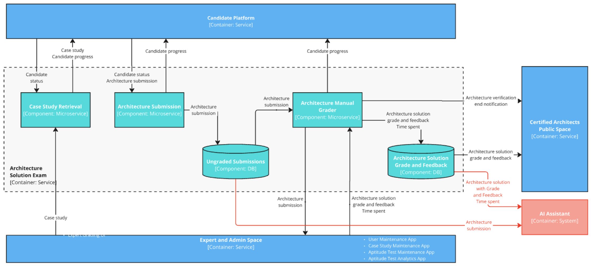

# Context Viewpoint <!-- omit in toc -->

> Describes the relationships, dependencies, and interactions between the system and its environment (the people, systems, and external entities with which it interacts).

In this viewpoint we will only highlight changes made to [Current State architecture](../../current_state/context_viewpoint/README.md).

## Table of Contents <!-- omit in toc -->

- [Level 2 - Container diagram - Certification Platform](#level-2---container-diagram---certification-platform)
- [Level 3 - Components](#level-3---components)
  - [Level 3 - Components - AI Assistant](#level-3---components---ai-assistant)
  - [Level 3 - Components - Candidate Space](#level-3---components---candidate-space)
  - [Level 3 - Components - Expert and Admin Space](#level-3---components---expert-and-admin-space)
  - [Level 3 - Components - Aptitude Test](#level-3---components---aptitude-test)
  - [Level 3 - Components - Architecture Solution Exam](#level-3---components---architecture-solution-exam)

# Level 2 - Container diagram - Certification Platform

> The Container diagram shows the high-level shape of the software architecture and how responsibilities are distributed across it. It also shows the major technology choices and how the containers communicate with one another

**Changes:**

1. Introduced **AI Assistant** with several functions:

   - Store historical records for all tests, candidate submissions, their grades and feedback, and the time experts spend grading.
   - Generate suggestions that experts can accept or reject when grading submissions.
   - Collect suggestions status to calculate suggestions performance and adjust the AI Assistant accordingly.
   - Detect anomalies and notify the designated expert for review.
   - Collect anomalies and appeals status to calculate grading quality.
2. Introduced a **new appeal process**:

   - Candidates can raise an appeal.
   - Designated experts review appeals and make necessary corrections.

# Level 3 - Components

> The Component diagram shows how a container is made up of a number of "components", what each of those components are, their responsibilities and the technology/implementation details.

## Level 3 - Components - AI Assistant

We propose implementing the **AI Assistant** using a **Micro-Kernel Architecture**.

The **Core Component** will act as the **central aggregator and integrator** for AI-based solutions. It will include:

- A **User Interface** for **AI Engineers** to manage and refine AI solutions.
- A **Suggestions Database** to store AI-generated grading recommendations.
- An **API** to serve AI-generated suggestions to the **Expert UI** during the grading process.

Each AI-powered grading solution will:

- Access **historical grading data** from a shared **common storage**.
- Provide an **API** for AI Engineers to adjust and refine the grading model.
- Populate the **Suggestions Database** in a standardized format, ensuring consistency across different solutions.

AI Analytics will:

- Analyze graded submissions to detect anomalies
- Calculate Validation Quality and Performance metrics

This approach enables the use of multiple suggestion generators simultaneously and allows for seamless replacement if any solution proves ineffective.

### Workflow

1. **Data Loading**:

   - The system loads **candidate submissions**, **grading criteria**, and **historical grading data** from:
     - **Aptitude Test** (Multiple-choice and short-answer responses)
     - **Architecture Solution Exam** (Case study submissions, grading rubrics)
   - Retrieves **past expert grading decisions**, **feedback records**, and **grading time logs** for AI model refinement.
2. **Generating AI-Based Grading Suggestions**:

   - Each **Aptitude Test Solution** and **Architecture Exam Solution** processes:
     - **Candidate responses** (short answers, architecture submissions)
     - **Predefined grading criteria and rubrics**
     - **Past grading patterns from experts**
   - AI-driven models **generate suggested grades and feedback**.
   - Suggestions, confidence scores, and AI-extracted rationales are **stored in AI Core**.
3. **Serving AI Suggestions to Experts**:

   - **AI Core** delivers **grading suggestions** to **Expert Grading Space**.
   - Experts see **AI-generated grades, explanations, and confidence scores**.
   - Experts can **review, accept, or modify** AI-generated grades before submission.
4. **Expert Feedback on AI Suggestions**:

   - Experts **approve or override** AI-generated suggestions.
   - System **logs expert feedback**, including:
     - **Accepted/rejected suggestions**
     - **Adjustments made to grades**
     - **Time spent reviewing AI-generated inputs**
   - This feedback is stored in **AI Core** as **suggestions status**.
5. **AI Performance Tracking & Continuous Improvement**:

   - **AI Engineers** track **suggestion accuracy**, **expert modifications**, and **confidence vs. rejection rates**.
   - AI models are **fine-tuned based on real expert corrections**.
6. **Anomaly Detection & Expert Review**:

   - **AI Analytics App** analyzes **historical grading trends** and **real-time grading activities**.
   - Detects **grading inconsistencies, outliers, and suspicious patterns**.
   - Flags cases where:
     - AI suggestions **deviate significantly from expert decisions**.
     - **Experts inconsistently apply grading rubrics**.
   - **Anomalies are sent to Expert Admin Space** for **manual review and intervention**.
7. **Quality & Time Performance Metrics Calculation**:

   - **AI Analytics App** stores:
     - **Anomalies and appeal statuses**
     - **Accuracy metrics for AI-suggested grades**
     - **Turnaround time for expert grading and appeals**
   - **Quality statistics** (grading consistency, rubric adherence) and **performance metrics** (average grading time, bottlenecks) are calculated.
   - AI Analytics App serve all metrics to the Core App.
8. **Continuous AI Model Enhancement**:

   - **AI Engineers** analyze:
     - **Grading quality trends**
     - **Time performance efficiency**
     - **Expert rejection/modification trends on AI suggestions**
   - **Necessary refinements** are made to AI models:
     - **Updating AI-generated grading criteria**
     - **Fine-tuning confidence thresholds for suggestions**
     - **Adjusting AI learning patterns based on expert corrections**
   - AI models are **retrained periodically** for **improved accuracy and efficiency**.

## Level 3 - Components - Candidate Space

**Changes:**

1. **Appeals Process Integration**:
   - Candidates can now **submit appeals** via the **Candidate Testing UI**.
   - Appeals are forwarded to the **Expert and Admin Space** for review.
   - **Appeals status updates** are sent back to the **Candidate Testing UI**.

## Level 3 - Components - Expert and Admin Space

**Changes:**

1. **AI Assistant Integration**:

   - Introduced **AI Assistant (Container: System)**.
   - **Generates suggestions** for grading.
   - Tracks **suggestions status**.
2. **Anomalies Detection**:

   - **Anomalies App (Component: Microservice)** added.
   - Tracks and stores **anomalies** and **anomalies status**.
   - **Notifies designated experts** for review.
3. **Appeals Handling**:

   - **Appeals App (Component: Microservice)** added.
   - **Appeals Database (Component: DB)** introduced for storing appeals and appeal statuses.
   - Tracks **appeals status**.
4. **New Data Flows**:

   - AI Assistant now **sends anomalies and appeal statuses** to the system.
   - **Case Study Grading Criterion** now interacts with the **AI Assistant**.
   - Appeals and anomalies data flow between **Appeals App**, **Anomalies App**, and **Expert Admin UI**.

## Level 3 - Components - Aptitude Test

**Changes:**

1. **AI Assistant (Container: System) Added**:
   - Introduced AI Assistant to assist in aptitude test grading.
   - Receives **short answers** from **Ungraded Short Answers (DB)**.
   - Receives **aptitude test short answers grade and feedback** from **Aptitude Test Grades (DB)**.

## Level 3 - Components - Architecture Solution Exam

**Changes:**

1. **AI Assistant (Container: System) Added**:
   - Introduced AI Assistant to assist in grading architecture submissions.
   - Receives **architecture submissions** from **Ungraded Submissions (DB)**.
   - Receives **architecture solution with grade and feedback** from **Architecture Solution Grade and Feedback (DB)**.
