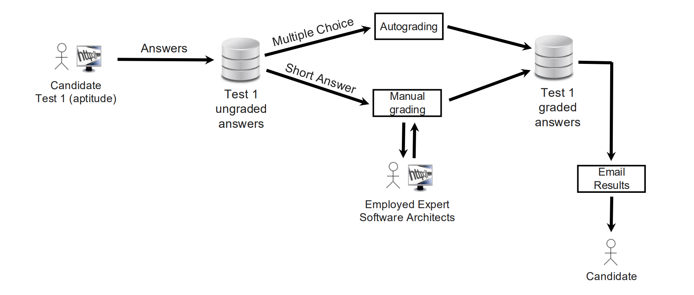
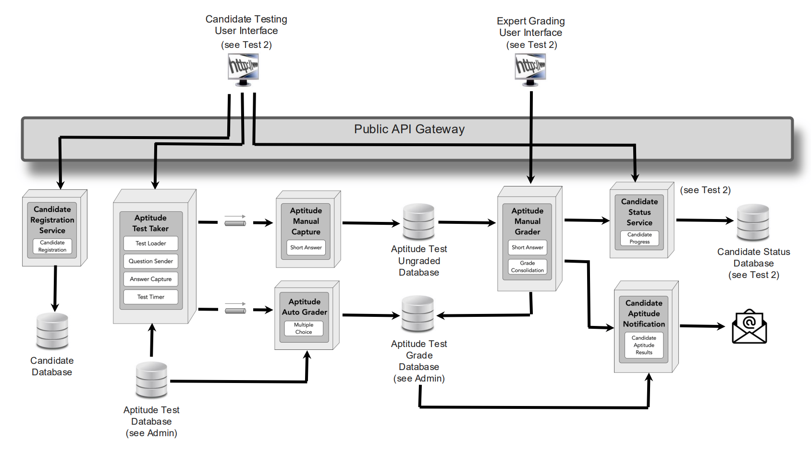
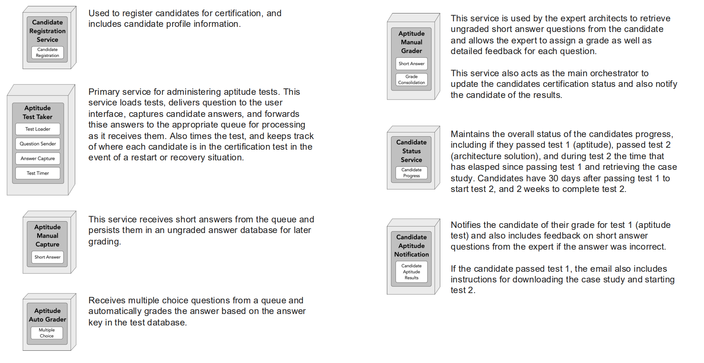
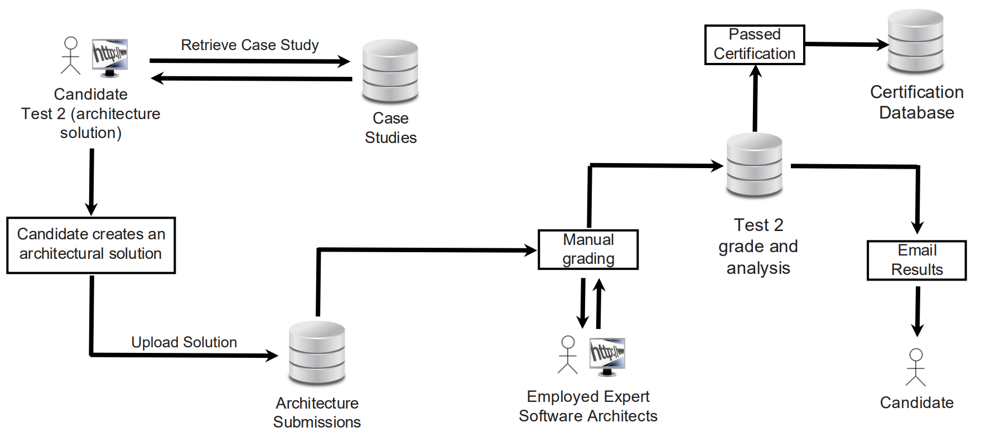
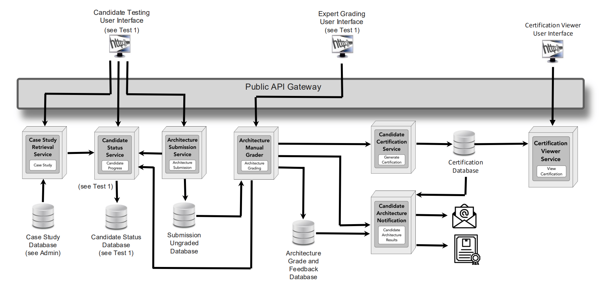
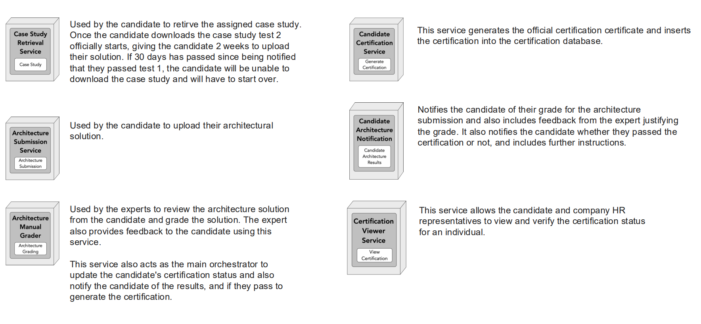
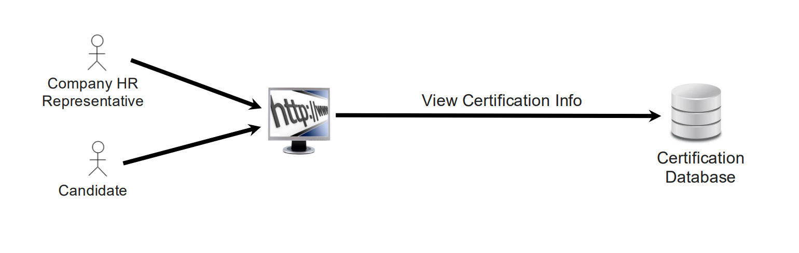
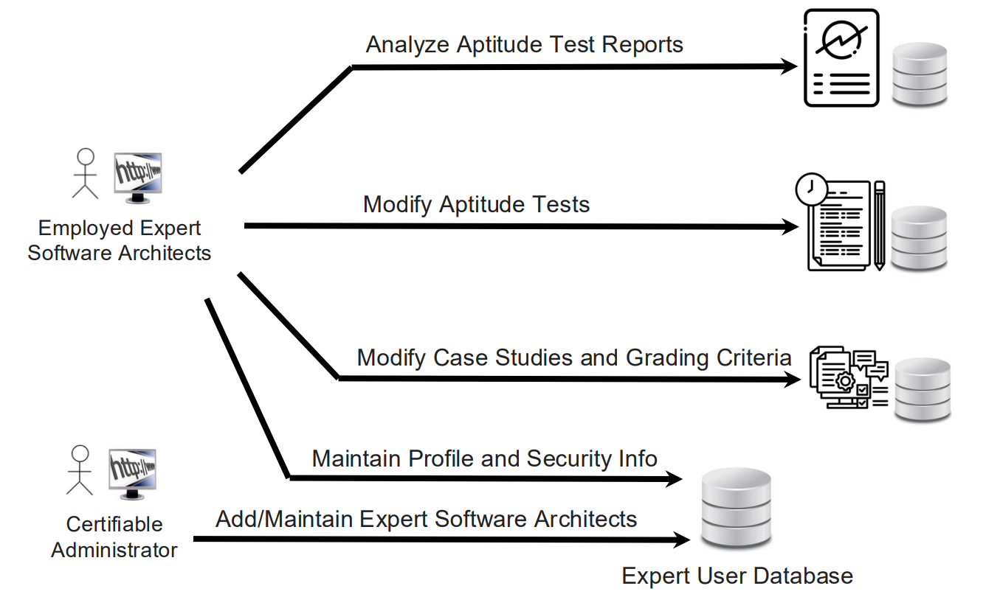
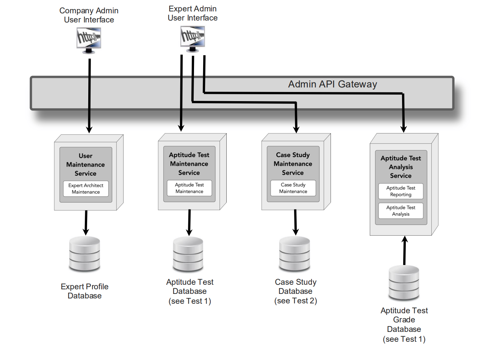
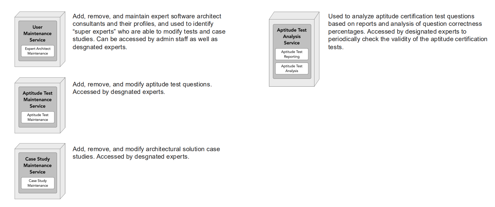

# Original Requirements

## A Historical Perspective…

We knew it would eventually happen, and sure enough it did. IT Professionals wishing to become a software architect (and existing software architects) must be licensed professions in the same way doctors, nurses, building architects, and lawyers are licensed. This law was passed in the U.S. several years ago, and a Software Architecture Licensing Board (the SALB) formed to accredit companies that administer certification exams. A handful of accredited companies, including Certifiable, Inc., sprang into existence to certify and license new and existing software architects.

Having seen the success of this new law, U.K, Europe, and Asia recently passed similar laws requiring software architecture certification to get or maintain a job as a Software Architect. The licensing boards from these continents all agreed that rather than trying to establish new certification tests and form new certification companies, they would for the time being leverage existing accredited U.S. companies to administer certification tests and license new and existing software architects.

### Additional Context

* The company currently employs 300 expert software architect consultants across the U.S. Of these, 5 are considered “designated” experts who have the authorization to modify certification tests and change/add case studies based on their own analysis and feedback from other employed expert software architects. Expert software architects hired by Certifiable, Inc. earn $50 per hour for grading certification exams. While this rate varies from company to company, it’s in line with what other accredited licensing companies pay for their experts.
* Currently, Certifiable, Inc. has on average 200 candidates per week seeking certification across the U.S. That number is expected to grow 5-10X based on oversees expansion as well as the anticipated 21% growth over the next 4 years.
* The certification exam to obtain software architecture licensing costs $800.00. This price is fixed and established by the SALB. Overseas nations have agreed to use this cost structure.

## Overview

Certifiable, Inc. is an accredited leader in software architecture certification based in the United States. They currently own a large part of the market share in the software architecture certification space. Their existing flagship system, SoftArchCert, provides accredited certification to qualified software architects. The company currently employs dozens of expert software architects to create and maintain certification tests and review and grade software architecture submissions as part of the certification program.

Recent acceptance of software architecture certification in other parts of the world, including Europe, U.K., and Asia, has put Certifiable, Inc. in a tailspin. Based on the expected increased volume of certification requests (5-10X the normal request volume), the company is worried that the manual processes they currently have in place will not
be able to handle the increased demand for software architecture certifications. Therefore, the company would like to see how Generative AI might be able to be applied to handle the increase in demand they are anticipating.

Your job as the architecture team for the SoftArchCert system is to determine how Generative AI might be used within the current system to address these rapid and significant growth problems. The company would like your team to identify opportunities for the use of AI in the existing system and redesign the architecture to support those
changes.

### Additional Context

* Currently, there are over 176,000 software architects in the US, with 300,000 job openings yet to be filled. That number across the U.K., Europe and Asia is estimated at 600,000. This field is expected to grow by 21% in the next four years, highlighting the high demand and the challenge of finding qualified professionals ([https://bit.ly/4jBdnDU](https://bit.ly/4jBdnDU)).
* Certifiable, Inc. Currently has 120,000 certified software architects in its certification database.
* Certifiable, Inc. guarantees a 1-week turnaround for grading test 1 (aptitude), and a 1-week turnaround for grading test 2 (architecture submission).
* Upon successful completion of test 1, candidates have 30 days to start the architecture submission (test 2), and 2 weeks to complete the architecture submission once started. Downloading the case study signifies the start of test 2.
* Although there are a handful of accredited software architect certification companies and boards, Certifiable, Inc. is recognized as the market leader, with over 80% of companies across the U.S. accepting (or insisting) on Certifiable, Inc’s certification. The same is true for overseas expansion.
* Certifiable, Inc. has heard that the use of AI can b e somewhat costly and are concerned about significant cost overruns by introducing AI into their certification process. However, while cost is certainly a factor, given that this initiative is a strategic one, they are willing to be somewhat flexible.

## Certification Process

The current certification process requires candidates to pass two different tests: an aptitude test and an architecture submission.

* The first test (aptitude test) involves multiple choice and short answer questions that the candidate takes through a web-based interface. Tests are timed to avoid candidates researching and looking up answers. Once the candidate has completed the test (or the time is up), the candidate answers are stored in a database for later grading. Multiple choice questions are auto-graded, whereas the short answer questions are graded by employed expert software architects (1 week turnaround). A grade of 80% is required to move onto the second test, which the details and links are emailed to the candidate once graded.
* The second test is a case study that the candidate must create an architecture for. There are five possible case studies available that are assigned at random for each candidate. The candidate has two weeks from the time they download the case study to the time they upload their architectural solution. Once uploaded, the employed expert software architects review the architecture submission and assign a grade based on a specific set of criteria. The expert software architect graders have 1 week to review the architecture submission once it is submitted by the candidate. The candidate submission are assigned randomly to the expert software architects. A comprehensive score of 80% is required to pass the second test and receive the accredited certification.
* If the candidate passes both tests, they receive the accredited certification, and their certification information stored in a certification database which companies can use to verify a candidate's certification and score. Only the candidates name, certification id, date of certification, and score are stored in the database. Companies wishing to verify a candidate's certification can enter this information into the SoftArchCert verification website (this information is provided by the candidate). Candidates that fail either test are provided a detailed email from the expert software architect describing why they did not pass the test. The candidate may then reapply to take the certification (candidates who passed the first test only need to retake the architecture submission test).

### Additional Context

* On average it takes an employed expert software architect 3 hours to grade the short answer questions in Test 1 (aptitude) for a given candidate and provide detailed reasons why an answer was incorrect or partially incorrect (candidate feedback).
* On average it takes an employed expert software architect 8 hours to grade the architecture submission in Test 2 (architecture solution) for a given candidate and provide a detailed analysis of the grading rationale (candidate feedback).

### Critical Information

* As a recognized leader in certification, accuracy of tests, case studies, and grading is job and. Inaccurate grading can result in a
  candidate not getting or maintaining a job and can impact a candidate's career.
* Inaccurate or misleading certification exams and case studies can undermine the credibility of the company’s current standing in the
  marketplace, so accuracy of the certification process is vital for the success of the company.

## Administrative Process

In addition to grading short answers and architecture submissions, employed Expert Software Architects are responsible for continually analyzing reports and results for the purposes of modifying existing certification tests. For example, if 95% of all candidates miss the same question, analysis should be done to modify the question or remove it. Also, as new techniques, practices, and patterns emerge in the industry, expert software architects add questions to reflect these advances.

Designated employed expert software architects are also responsible for periodically editing and creating new case studies for the second test to prevent case studies and answers from leaking out to the internet.

Employed expert software architects are contractors (freelance workers) who work on an hourly basis with contracts for time they work per week. The number of hours per week may vary based on demand.

An administrator from Certifiable, Inc. maintains the expert software architects in the system in terms of profiles and sign-in credentials (experts can also modify their profiles and sign-in credentials once they are added to the system by the administrator).

## Architecture Diagrams

### Certification Process (Test 1: Aptitude Test)

#### Architecture

#### Components

### Certification Process (Test 2: Architecture Solution)

#### Architecture

#### Components

### View Certification Results Process

### Administration Process

#### Architecture

#### Components

